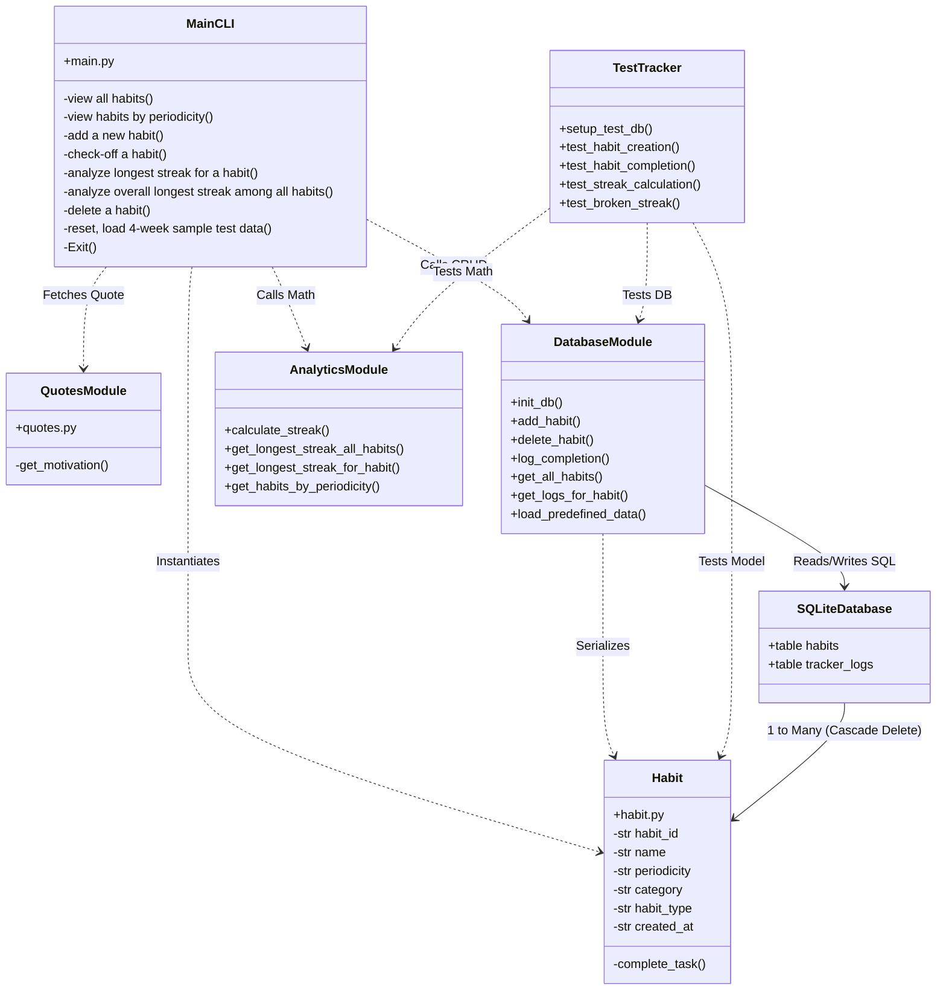

```mermaid
classDiagram
    direction TB

    class MainCLI {
        +main.py
        -view all habits()
        -view habits by periodicity()
        -add a new habit()
        -check-off a habit()
        -analyze longest streak for a habit()
        -analyze overall longest streak among all habits()
        -delete a habit()
        -reset, load 4-week sample test data()
        -Exit()
    }

    class QuotesModule {
        +quotes.py
        -get_motivation()
    }

    class Habit {
        +habit.py
        -str habit_id
        -str name
        -str periodicity
        -str category
        -str habit_type
        -str created_at
        -complete_task()
    }

    class DatabaseModule {
        +init_db()
        +add_habit()
        +delete_habit()
        +log_completion()
        +get_all_habits()
        +get_logs_for_habit()
        +load_predefined_data()
    }

    class AnalyticsModule {
        +calculate_streak()
        +get_longest_streak_all_habits()
        +get_longest_streak_for_habit()
        +get_habits_by_periodicity()
    }

    class TestTracker {
        +setup_test_db()
        +test_habit_creation()
        +test_habit_completion()
        +test_streak_calculation()
        +test_broken_streak()
    }

    class SQLiteDatabase {
        +table habits
        +table tracker_logs
    }

    MainCLI ..> Habit : Instantiates
    MainCLI ..> DatabaseModule : Calls CRUD
    MainCLI ..> AnalyticsModule : Calls Math
    MainCLI ..> QuotesModule : Fetches Quote

    DatabaseModule ..> Habit : Serializes
    DatabaseModule --> SQLiteDatabase : Reads/Writes SQL

    TestTracker ..> DatabaseModule : Tests DB
    TestTracker ..> AnalyticsModule : Tests Math
    TestTracker ..> Habit : Tests Model

    SQLiteDatabase --> Habit : 1 to Many (Cascade Delete)
```